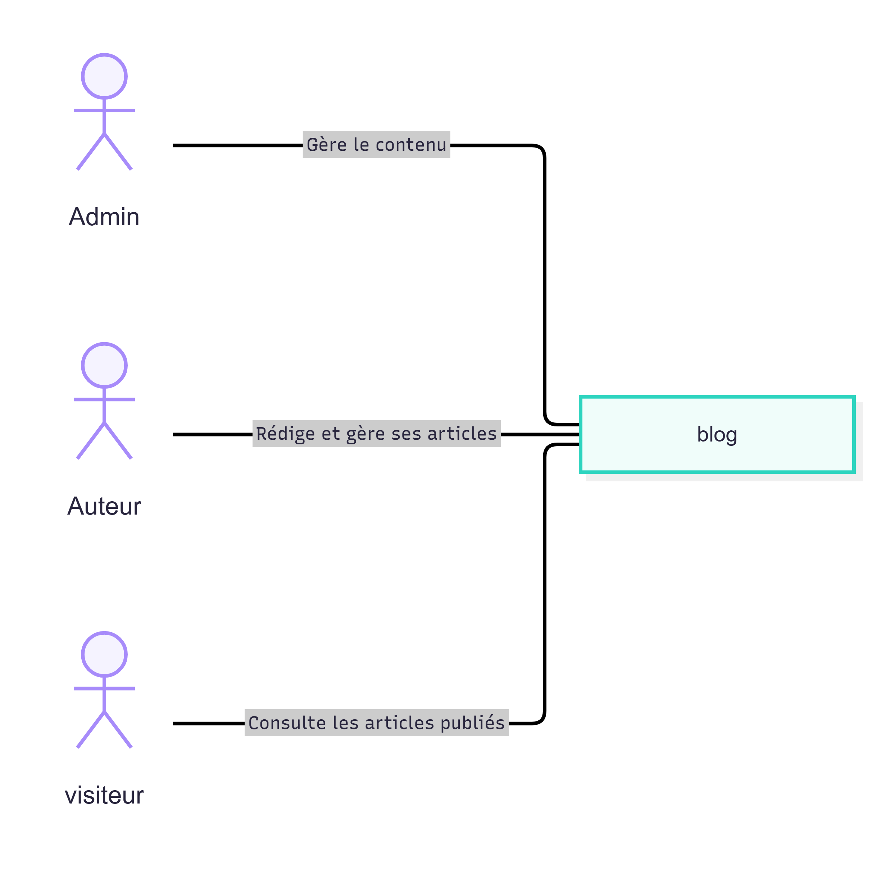

# Identifier le système
Nom De Systeme : Blog

# Identifier les acteurs et leurs objectifs
Administrateur :  Gère le contenu .

Auteur : Rédige et gère ses articles .

Visiteur : Consulte les articles publiés

