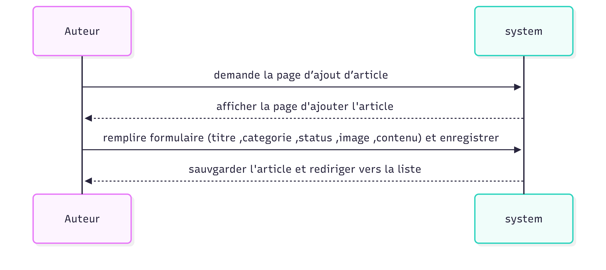

Cas d’utilisation : Ajouter un article
Acteur principal : Auteur
Précondition : L’Auteur est connecté au blog.
Déclencheur : L’Auteur veut rédiger un nouvel article.

Scénario nominal :
 -L’Auteur demande la page d’ajout d’article.
 -le systeme affiche la page d'ajouter l'article.
 -auteur saisit le titre , selectionner le categorie , selectionner status , telecharger image , rédige  le contenu 
 -l'auteur click sur Enregistrer l'article
 -le systeme sauvgarder l'article
 -le systeme deriger l'auteur vers la liste des articles

 Résultat attendu : L’article est enregistré et l’Auteur est redirigé vers la gestion des articles.

 # Modélisation 
 
